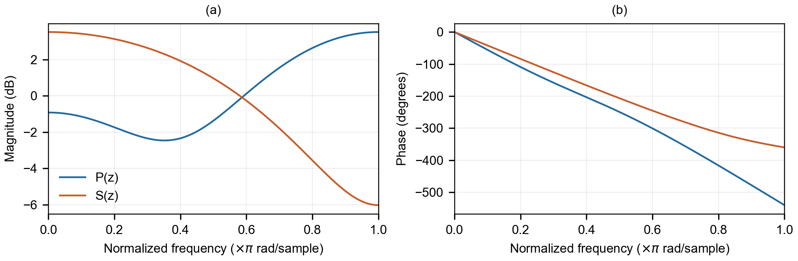
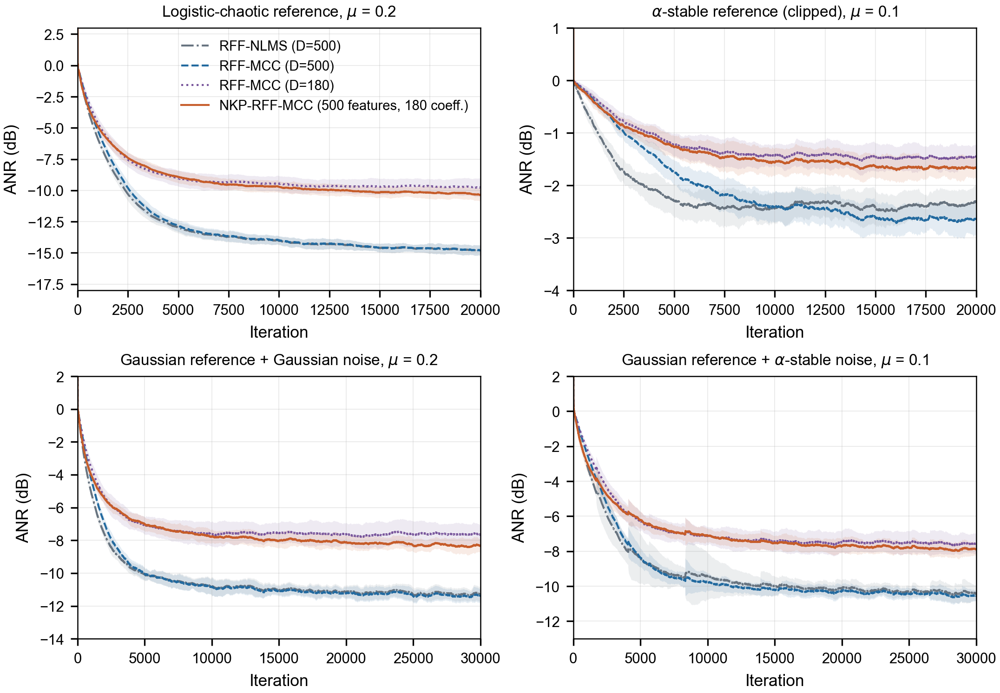
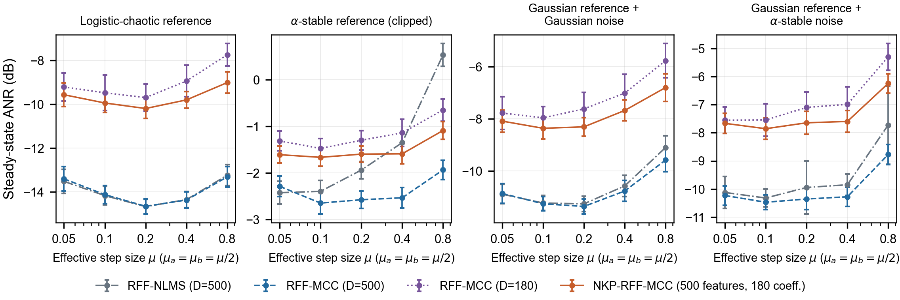
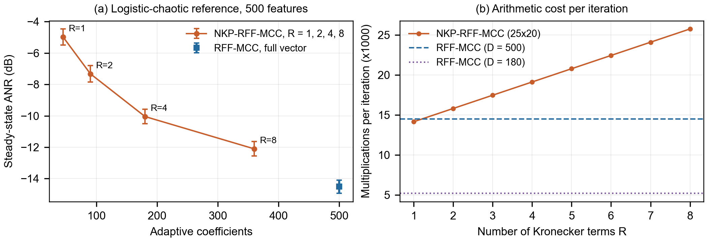

# Kronecker-Structured Adaptation of Random Fourier Feature Controllers for Nonlinear Active Noise Control

**Authors:** [Author names]
**Corresponding author:** [Name and email]
**Affiliation:** [Department, institution, city, postal code, country]

> Stage draft for supervisor review (2026-09-26). All simulation numbers and Figs. 2–4 come from the unified re-implementation in `experiments_v10/` (20 independent runs per setting; per-run data in `experiments_v10/data/`, statistics in `experiments_v10/results/`). Fig. 1 is computed analytically from Eq. (3).

## Highlights

- Kronecker structure decouples RFF feature dimension from adaptive state size
- Sequential correntropy factor updates with guaranteed a posteriori contraction
- Each factor update is an exact positive-semidefinite preconditioned update
- With 180 adaptive coefficients, a 500-feature map beats a 180-feature controller
- Chaotic, impulsive, and Gaussian references; 20 independent runs per setting

## Abstract

Random Fourier features (RFFs) turn kernel-based nonlinear active noise control (ANC) into linear adaptation in a fixed feature space, but they tie the number of adaptive coefficients to the number of features: a richer nonlinear map always means a larger adaptive state. This paper removes that coupling. The output-coefficient vector of an RFF controller is represented by a sum of $R$ Kronecker products of short factors, so that a map with $D = D_1 D_2$ features is adapted through only $R(D_1 + D_2)$ coefficients. The factors are updated sequentially by normalized maximum-correntropy recursions driven by secondary-path-filtered features. Each factor update is shown to be an exact filtered-x update of the full coefficient vector with a positive semidefinite, factor-dependent preconditioner, and the a posteriori residual is guaranteed not to increase for $0 < \mu_a, \mu_b < 2$; a simultaneous update of both factors admits no such guarantee. Simulations with a nonlinear primary path under logistic-chaotic, $\alpha$-stable, and Gaussian conditions, each with 20 independent runs, show that at an equal budget of 180 adaptive coefficients, the structured controller over 500 features attains a lower steady-state residual than a 180-feature controller in all four test conditions (by 0.19–0.69 dB; paired Wilcoxon $p \le 0.011$). The number of Kronecker terms provides a graded trade-off between adaptive state size and attenuation.

**Keywords:** nonlinear active noise control; random Fourier features; Kronecker product decomposition; maximum correntropy criterion; filtered-x normalized least mean square

## 1. Introduction

Nonlinear active noise control (ANC) is required whenever the path from the noise source to the error microphone, the actuator, or the noise process itself is nonlinear, as with saturating loudspeakers or chaotic and impulsive sources [ref1]. Polynomial, functional-link, spline, neural-network, and kernel controllers have been developed for these settings [ref1]. Among them, kernel methods offer universal approximation with a convex adaptation problem, and random Fourier features (RFFs) make them practical: an explicit map of predetermined dimension $D$ approximates a shift-invariant kernel [ref2], so that the controller becomes a linear filter in a fixed feature space. RFF-based adaptive filters have been developed for multikernel learning [ref3], and RFF controllers have been introduced for multichannel narrowband ANC [ref4], combined with a generalized hyperbolic tangent criterion and conjugate-gradient optimization [ref10], and extended to several fused feature maps under generalized correntropy [ref11].

In all of these controllers, every feature carries its own adaptive coefficient. The feature dimension therefore fixes two quantities at once: the richness of the nonlinear representation and the size of the adaptive state, that is, the number of coefficients that must be stored, normalized, and updated at every sample. Improving the representation by adding features necessarily enlarges the adaptation problem, and reducing the adaptive state necessarily discards features. None of the RFF controllers cited above allows these two quantities to be chosen independently.

Robustness to non-Gaussian disturbances is the second requirement. The maximum correntropy criterion (MCC) weights each error by a Gaussian kernel of its magnitude, so that excursions much larger than the kernel width have a vanishing influence on the update [ref5]. Variable kernel widths [ref6], Euclidean-direction-search MCC updates [ref7], projection-based FxLMS for impulsive environments [ref8], and fractional-order generalized complex correntropy [ref9] have extended this idea to ANC.

Kronecker product decomposition (KPD) provides the missing degree of freedom. It has been used to build robust adaptive filters [ref15] and multichannel filtered-x ANC algorithms [ref16, ref17], and related low-rank structures have been applied to spline [ref13] and Volterra [ref14] controllers; structural redesign has also been used to accelerate functional-link ANC [ref12]. In these works, the decomposition shortens the taps of a linear filter or of a polynomial expansion. This paper applies it to the output coefficients of an RFF map, where it separates the feature dimension $D = D_1 D_2$ from the adaptive state $R(D_1 + D_2)$.

The contributions of this paper are as follows.

1. **Kronecker-structured RFF controller.** The RFF output-coefficient vector is represented by $R$ Kronecker products of short factors, which are adapted by sequential normalized correntropy recursions with explicit projected regressors computed from secondary-path-filtered features (Section 3).
2. **Exact preconditioned form and guaranteed contraction.** Each factor update is shown to be an exact filtered-x update of the full coefficient vector with a positive semidefinite, factor-dependent preconditioner. As a consequence, the a posteriori residual does not increase for $0 < \mu_a, \mu_b < 2$, a guarantee that the simultaneous update of both factors does not provide (Section 4).
3. **Evidence at an equal adaptive budget.** In four test conditions with 20 independent runs each, the structured controller over 500 features outperforms a 180-feature controller with the same number of adaptive coefficients, and the number of Kronecker terms controls a graded trade-off between adaptive state size and attenuation (Section 5).

## 2. Nonlinear ANC model and random Fourier features

*Notation.* Column vectors are bold lowercase and matrices bold uppercase; $(\cdot)^T$ denotes transposition, $\otimes$ the Kronecker product, $\mathrm{vec}(\cdot)$ columnwise vectorization, $\|\cdot\|_2$ the Euclidean norm, and $\mathbf{I}_M$ the $M \times M$ identity matrix.

### 2.1 Signal model

The reference vector is $\mathbf{x}_n = [x(n), x(n-1), \ldots, x(n-M+1)]^T \in \mathbb{R}^M$. With controller output $y(n)$ and secondary-path coefficients $s_\ell$, the error at the microphone is

$$
y_s(n) = \sum_{\ell=0}^{L_s-1} s_\ell\, y(n-\ell), \qquad e(n) = d(n) - y_s(n) + v(n), \tag{1}
$$

where $d(n)$ is the primary disturbance and $v(n)$ measurement noise. The linear parts of the primary and secondary paths are

$$
P(z) = z^{-3} - 0.3z^{-4} + 0.2z^{-5}, \qquad S(z) = z^{-2} + 0.5z^{-3}, \tag{2}
$$

so that $L_s = 4$ including leading zeros. With $g(n)$ the output of $P(z)$ driven by $x(n)$, the disturbance contains memory and second- and third-order terms:

$$
d(n) = g(n-2) + 0.08\,g^2(n-2) - 0.04\,g^3(n-1). \tag{3}
$$

The frequency responses of $P(z)$ and $S(z)$ are shown in Fig. 1; $S(z)$ is minimum phase.

**Fig. 1.** Frequency responses of the primary and secondary paths in Eq. (2): (a) magnitude and (b) phase.

### 2.2 Random Fourier feature map

For a Gaussian kernel with length scale $\ell_r$, frequency vectors $\boldsymbol{\omega}_j \sim \mathcal{N}(\mathbf{0}, \ell_r^{-2}\mathbf{I}_M)$ and phases $b_j \sim \mathcal{U}[0, 2\pi)$, $j = 1, \ldots, D$, are drawn once and kept fixed. The feature vector is

$$
\mathbf{z}_n = \sqrt{2/D}\,\big[\cos(\boldsymbol{\omega}_1^T \mathbf{x}_n + b_1), \ldots, \cos(\boldsymbol{\omega}_D^T \mathbf{x}_n + b_D)\big]^T, \tag{4}
$$

whose expected inner products equal the Gaussian kernel [ref2]. A full RFF controller outputs $y(n) = \mathbf{w}_n^T \mathbf{z}_n$ with $\mathbf{w}_n \in \mathbb{R}^D$. Each feature sequence is filtered by the secondary-path model,

$$
\mathbf{q}_n = \sum_{\ell=0}^{L_s-1} s_\ell\, \mathbf{z}_{n-\ell}, \tag{5}
$$

and, for slowly varying coefficients, $\mathbf{w}_n^T \mathbf{q}_n$ approximates the secondary-path output.

### 2.3 Normalized correntropy adaptation

For a kernel width $\sigma_c > 0$, the correntropy influence function is

$$
\psi(e) = e\, g(e), \qquad g(e) = \exp\!\left(-\frac{e^2}{2\sigma_c^2}\right) \in (0, 1], \tag{6}
$$

which behaves like $e$ for $|e| \ll \sigma_c$ and vanishes for $|e| \gg \sigma_c$. The adaptation residual is

$$
\epsilon_n = d(n) + v(n) - \mathbf{w}_n^T \mathbf{q}_n, \tag{7}
$$

where $d(n) + v(n) = e(n) + y_s(n)$ is reconstructed from the measured error and the controller output filtered by the secondary-path model. The full-vector controller is updated as

$$
\mathbf{w}_{n+1} = \mathbf{w}_n + \mu\, \frac{\psi(\epsilon_n)}{\varepsilon + \|\mathbf{q}_n\|_2^2}\, \mathbf{q}_n, \tag{8}
$$

with step size $\mu$ and regularization $\varepsilon > 0$. We denote this controller RFF-MCC, and its counterpart with $\psi(e) = e$ RFF-NLMS.

## 3. Kronecker-structured correntropy adaptation

### 3.1 Coefficient structure

Let $D = D_1 D_2$ and represent the coefficient vector as

$$
\mathbf{w}_n = \sum_{r=1}^{R} \mathbf{a}_{r,n} \otimes \mathbf{b}_{r,n} = \mathrm{vec}(\mathbf{B}_n \mathbf{A}_n^T), \tag{9}
$$

with $\mathbf{A}_n = [\mathbf{a}_{1,n}, \ldots, \mathbf{a}_{R,n}] \in \mathbb{R}^{D_1 \times R}$ and $\mathbf{B}_n = [\mathbf{b}_{1,n}, \ldots, \mathbf{b}_{R,n}] \in \mathbb{R}^{D_2 \times R}$. Let $\mathbf{Z}_n, \mathbf{Q}_n \in \mathbb{R}^{D_2 \times D_1}$ satisfy $\mathrm{vec}(\mathbf{Z}_n) = \mathbf{z}_n$ and $\mathrm{vec}(\mathbf{Q}_n) = \mathbf{q}_n$. Then

$$
y(n) = \mathrm{tr}(\mathbf{B}_n^T \mathbf{Z}_n \mathbf{A}_n), \qquad \mathbf{w}_n^T \mathbf{q}_n = \mathrm{tr}(\mathbf{B}_n^T \mathbf{Q}_n \mathbf{A}_n). \tag{10}
$$

All $D$ features contribute to the output, while the adaptive state consists of $R(D_1 + D_2)$ coefficients. Because the random features are drawn independently and identically, the assignment of features to the rows and columns of $\mathbf{Z}_n$ has no preferred order; the structure acts on the adaptation, not on a physical ordering of the coefficients.

### 3.2 Sequential factor updates

With $\mathbf{a}_n = \mathrm{vec}(\mathbf{A}_n)$ and $\mathbf{b}_n = \mathrm{vec}(\mathbf{B}_n)$, the model output is linear in each factor when the other is fixed. The controller exploits this by updating the factors in sequence. First, with the regressor $\mathbf{u}_{b,n} = \mathrm{vec}(\mathbf{Q}_n \mathbf{A}_n)$ and residual $\epsilon_n = d(n) + v(n) - \mathbf{b}_n^T \mathbf{u}_{b,n}$,

$$
\mathbf{b}_{n+1} = \mathbf{b}_n + \mu_b\, \frac{\psi(\epsilon_n)}{\varepsilon + \|\mathbf{u}_{b,n}\|_2^2}\, \mathbf{u}_{b,n}. \tag{11}
$$

Then, with the regressor recomputed from the updated factor, $\mathbf{u}_{a,n} = \mathrm{vec}(\mathbf{Q}_n^T \mathbf{B}_{n+1})$, and the corresponding residual $\epsilon'_n = d(n) + v(n) - \mathbf{a}_n^T \mathbf{u}_{a,n}$,

$$
\mathbf{a}_{n+1} = \mathbf{a}_n + \mu_a\, \frac{\psi(\epsilon'_n)}{\varepsilon + \|\mathbf{u}_{a,n}\|_2^2}\, \mathbf{u}_{a,n}. \tag{12}
$$

Computing $\mathbf{u}_{a,n}$ after rather than before the update of $\mathbf{b}_n$ costs no additional contraction: each iteration still forms one product $\mathbf{Q}_n\mathbf{A}_n$ and one product $\mathbf{Q}_n^T\mathbf{B}_{n+1}$. The resulting controller is denoted NKP-RFF-MCC. The factors are initialized with small independent Gaussian values, since zero factors would make both regressors vanish.

**Algorithm 1 (NKP-RFF-MCC).** For $n = 0, 1, 2, \ldots$:
1. Form $\mathbf{x}_n$, compute $\mathbf{z}_n$ by Eq. (4), and obtain $\mathbf{q}_n$ by Eq. (5).
2. Output $y(n) = \mathrm{tr}(\mathbf{B}_n^T \mathbf{Z}_n \mathbf{A}_n)$.
3. Reconstruct $d(n) + v(n) = e(n) + y_s(n)$ from the measured error.
4. Update $\mathbf{b}_n$ by Eq. (11).
5. Recompute $\mathbf{u}_{a,n}$ and $\epsilon'_n$ with $\mathbf{B}_{n+1}$ and update $\mathbf{a}_n$ by Eq. (12).

## 4. Analysis

### 4.1 Exact preconditioned form

Using $\mathrm{vec}(\mathbf{X}\mathbf{Y}\mathbf{Z}) = (\mathbf{Z}^T \otimes \mathbf{X})\,\mathrm{vec}(\mathbf{Y})$, the change of the full coefficient vector produced by Eq. (11) is $\mathrm{vec}(\Delta\mathbf{B}_n \mathbf{A}_n^T)$ with $\Delta\mathbf{B}_n = c_{b,n}\psi(\epsilon_n)\mathbf{Q}_n\mathbf{A}_n$ and $c_{b,n} = \mu_b / (\varepsilon + \|\mathbf{u}_{b,n}\|_2^2)$. Writing $\mathbf{w}'_n = \mathrm{vec}(\mathbf{B}_{n+1}\mathbf{A}_n^T)$ for the intermediate vector, the two steps are

$$
\mathbf{w}'_n = \mathbf{w}_n + \psi(\epsilon_n)\,\mathbf{P}_{b,n}\mathbf{q}_n, \qquad
\mathbf{w}_{n+1} = \mathbf{w}'_n + \psi(\epsilon'_n)\,\mathbf{P}_{a,n}\mathbf{q}_n, \tag{13}
$$

$$
\mathbf{P}_{b,n} = c_{b,n}\,(\mathbf{A}_n\mathbf{A}_n^T \otimes \mathbf{I}_{D_2}), \qquad
\mathbf{P}_{a,n} = c_{a,n}\,(\mathbf{I}_{D_1} \otimes \mathbf{B}_{n+1}\mathbf{B}_{n+1}^T), \tag{14}
$$

with $c_{a,n} = \mu_a / (\varepsilon + \|\mathbf{u}_{a,n}\|_2^2)$. Equation (13) is exact. Each factor step is therefore a filtered-x correntropy update of the full coefficient vector in which the scalar normalization of Eq. (8) is replaced by a symmetric positive semidefinite matrix determined by the current factors. The structured controller uses the same features and the same residual as the full controller; what changes is the geometry of each correction, which is confined to directions spanned by the companion factor.

### 4.2 Guaranteed a posteriori contraction

Since the output is linear in $\mathbf{b}$ for fixed $\mathbf{A}_n$, substituting Eq. (11) gives the residual after the first step, $\epsilon_n^{+} = d(n) + v(n) - \mathbf{b}_{n+1}^T\mathbf{u}_{b,n}$, as

$$
\epsilon_n^{+} = \big(1 - g(\epsilon_n)\,\mu_b\,\rho_{b,n}\big)\,\epsilon_n, \qquad \rho_{b,n} = \frac{\|\mathbf{u}_{b,n}\|_2^2}{\varepsilon + \|\mathbf{u}_{b,n}\|_2^2} \in [0, 1), \tag{15}
$$

and in the same way the second step gives $\epsilon'^{+}_n = (1 - g(\epsilon'_n)\mu_a\rho_{a,n})\,\epsilon'_n$, with $\rho_{a,n}$ defined analogously and $\epsilon'_n = \epsilon_n^{+}$ because $\mathbf{a}_n^T\mathbf{u}_{a,n} = \mathbf{b}_{n+1}^T\mathbf{u}_{b,n}$.

**Proposition 1.** If $0 < \mu_a < 2$ and $0 < \mu_b < 2$, the residual evaluated with the updated factors and the same data satisfies $|\epsilon'^{+}_n| \le |\epsilon_n|$, with strict inequality whenever $\psi(\epsilon_n) \ne 0$ and $\mathbf{u}_{b,n} \ne \mathbf{0}$.

*Proof.* Since $0 < g \le 1$ and $0 \le \rho < 1$, both factors $1 - g\mu\rho$ in Eq. (15) lie in $(-1, 1]$ for $0 < \mu < 2$, and the first is strictly smaller than one in magnitude under the stated condition. $\square$

The sequential order is essential. If both factors are updated from the same regressors, the residual acquires the bilinear term $-\mathrm{tr}(\Delta\mathbf{B}_n^T\mathbf{Q}_n\Delta\mathbf{A}_n)$, which is not controlled by the step sizes alone. For $R = D_1 = D_2 = 1$, $\mathbf{Q}_n = 1$, $d(n) = 1$, $a_n = b_n = 0.01$, $\sigma_c = 2$, $\varepsilon = 10^{-8}$, and $\mu_a = \mu_b = 0.08$, the simultaneous update produces $\Delta a_n = \Delta b_n \approx 7.059$ and a residual of $-48.97$ from an initial $0.9999$, whereas the sequential update of Eqs. (11)–(12) reduces it to $0.929$ and then $0.863$. Proposition 1 and Eq. (15) were additionally checked on $10^5$ random instances with $0 < \mu_a, \mu_b < 2$ without a single violation.

### 4.3 Bound on factor increments

Since $\sup_e |\psi(e)| = \sigma_c e^{-1/2}$ and $\|\mathbf{u}\|_2 / (\varepsilon + \|\mathbf{u}\|_2^2) \le 1/(2\sqrt{\varepsilon})$,

$$
\|\mathbf{b}_{n+1} - \mathbf{b}_n\|_2 \le \frac{\mu_b\sigma_c e^{-1/2}}{2\sqrt{\varepsilon}}, \qquad
\|\mathbf{a}_{n+1} - \mathbf{a}_n\|_2 \le \frac{\mu_a\sigma_c e^{-1/2}}{2\sqrt{\varepsilon}}, \tag{16}
$$

for every realization of the error, so large impulsive residuals cannot produce unbounded factor jumps.

### 4.4 Adaptive state and arithmetic

The structured controller adapts $R(D_1 + D_2)$ coefficients instead of $D$; the fixed frequencies and phases ($DM + D$ values) are shared with the full controller and can be regenerated from a stored seed. Table 1 counts real multiplications per iteration, including the feature map, secondary-path filtering, controller output, residual prediction, normalization, and increments.

**Table 1.** Adaptive state and multiplications per iteration ($M = 20$, $L_s = 4$).

| Controller | Features | Adaptive coefficients | Fixed map values | Multiplications |
| --- | --- | --- | --- | --- |
| RFF-MCC | 500 | 500 | 10,500 | 14,504 |
| NKP-RFF-MCC ($25 \times 20$, $R = 4$) | 500 | 180 | 10,500 | 19,128 |
| RFF-MCC | 180 | 180 | 3,780 | 5,224 |

The general counts are $DM + DL_s + 5D + 4$ for the full controller and $DM + DL_s + D + 3RD + RD_2 + 3R(D_1 + D_2) + 8$ for the structured controller. The structured controller thus invests arithmetic, rather than adaptive state, to exploit a larger feature map; Fig. 4(b) shows how this investment grows with $R$.

## 5. Simulation results

### 5.1 Setup

Four test conditions are used with the nonlinear model of Section 2.1: (C1) a logistic-chaotic reference generated by $u(n) = 4u(n-6)[1 - u(n-6)]$ with six random initial states per run, centered and normalized to unit variance; (C2) a symmetric $\alpha$-stable reference ($\alpha = 1.6$, Chambers–Mallows–Stuck generator), normalized by its median absolute value and clipped to $\pm 5$; (C3) a Gaussian reference with Gaussian measurement noise of standard deviation 0.01; and (C4) a Gaussian reference with symmetric $\alpha$-stable measurement noise ($\alpha = 1.6$, scale 0.05). C1 and C2 run for 20,000 iterations and C3 and C4 for 30,000. Performance is measured by the average noise reduction

$$
\mathrm{ANR}(n) = 20\log_{10}\frac{A_e(n) + \epsilon_a}{A_d(n) + \epsilon_a}, \quad
A_e(n) = \beta A_e(n-1) + (1-\beta)|e(n)|, \quad
A_d(n) = \beta A_d(n-1) + (1-\beta)|d(n)|, \tag{17}
$$

with $\beta = 0.999$ and $\epsilon_a = 10^{-12}$; negative values indicate attenuation. The steady-state ANR is the mean of $\mathrm{ANR}(n)$ over the last 5,000 iterations of each run.

Four controllers are compared: RFF-NLMS and RFF-MCC with $D = 500$, RFF-MCC with $D = 180$, and NKP-RFF-MCC with $D = 500$, $25 \times 20$ factors, and $R = 4$. The last two share the same budget of 180 adaptive coefficients. Every run draws its own RFF map, factor initialization, reference, and noise, so the 20 runs of each setting are independent realizations; paired comparisons use the exact Wilcoxon signed-rank test. For the structured controller, $\mu_a = \mu_b = \mu/2$, so that its first-order a posteriori contraction matches that of a full controller with step $\mu$. Each controller is evaluated at $\mu \in \{0.05, 0.1, 0.2, 0.4, 0.8\}$, and the operating point reported below is the step size that minimizes the steady-state ANR of RFF-MCC ($\mu = 0.2$ in C1 and C3, $\mu = 0.1$ in C2 and C4). Table 2 lists all parameters.

**Table 2.** Simulation parameters.

| Quantity | Value |
| --- | --- |
| Reference length $M$ | 20 |
| Features $D$, factor sizes | 500, $D_1 = 25$, $D_2 = 20$ |
| Kronecker terms $R$ | 4 (1–8 in Section 5.3) |
| RFF length scale $\ell_r$ | 3.9 |
| Correntropy width $\sigma_c$ | 2 |
| Regularization $\varepsilon$ | $10^{-8}$ |
| Step sizes | $\mu \in \{0.05, 0.1, 0.2, 0.4, 0.8\}$; structured: $\mu_a = \mu_b = \mu/2$ |
| Factor initialization | $0.01 \times$ standard normal |
| ANR smoothing $\beta$, $\epsilon_a$ | 0.999, $10^{-12}$ |
| Iterations | 20,000 (C1, C2); 30,000 (C3, C4) |
| Runs | 20 independent realizations per setting |

### 5.2 Equal adaptive budget

Figure 2 shows the learning curves at the operating point, and Table 3 lists the steady-state levels. In all four conditions, the structured controller attains a lower residual than the 180-feature controller that has the same number of adaptive coefficients: by 0.50 dB in C1 (lower in 18 of 20 paired runs), 0.19 dB in C2 (15/20), 0.69 dB in C3 (16/20), and 0.31 dB in C4 (15/20), with paired Wilcoxon $p$-values between $3.9 \times 10^{-4}$ and $1.1 \times 10^{-2}$. It also reaches $-5$ dB earlier on average in C1, C3, and C4. The additional 320 features therefore translate into attenuation although the adaptive state is unchanged. The full-vector controllers, which adapt all 500 coefficients, mark the attenuation attainable by the feature map; the structured controller retains 63–75% of that attenuation in decibels with 36% of the adaptive coefficients.

**Fig. 2.** ANR learning curves at the operating point (mean over 20 independent runs; shaded bands, $\pm$ one standard deviation). The vertical range omits the first few samples, in which $d(n) = 0$ because of the primary-path delay and the ANR ratio is not meaningful.

**Table 3.** Steady-state ANR (dB, mean $\pm$ standard deviation over 20 runs) and mean iterations to reach $-5$ dB at the operating point.

| Condition ($\mu$) | RFF-NLMS, $D$=500 | RFF-MCC, $D$=500 | RFF-MCC, $D$=180 | NKP-RFF-MCC, 180 coeff. |
| --- | --- | --- | --- | --- |
| C1 chaotic (0.2) | $-14.67 \pm 0.34$ / 807 | $-14.65 \pm 0.34$ / 956 | $-9.69 \pm 0.61$ / 1,169 | $-10.19 \pm 0.45$ / 1,063 |
| C2 $\alpha$-stable reference (0.1) | $-2.39 \pm 0.23$ / – | $-2.64 \pm 0.23$ / – | $-1.47 \pm 0.21$ / – | $-1.66 \pm 0.19$ / – |
| C3 Gaussian + Gaussian noise (0.2) | $-11.26 \pm 0.29$ / 985 | $-11.36 \pm 0.29$ / 1,242 | $-7.62 \pm 0.64$ / 1,814 | $-8.31 \pm 0.35$ / 1,596 |
| C4 Gaussian + $\alpha$-stable noise (0.1) | $-10.32 \pm 0.32$ / 1,973 | $-10.47 \pm 0.26$ / 2,318 | $-7.54 \pm 0.57$ / 3,084 | $-7.86 \pm 0.38$ / 2,731 |

"–": $-5$ dB not reached within the record.

Figure 3 repeats the comparison over the whole step-size range. The ordering of the mean steady-state levels of the two controllers with 180 adaptive coefficients is the same at every step size and in every condition, so the advantage does not depend on the choice of operating point.

**Fig. 3.** Steady-state ANR versus step size (mean $\pm$ one standard deviation over 20 runs). For NKP-RFF-MCC, $\mu_a = \mu_b = \mu/2$.

### 5.3 Graded trade-off through the number of Kronecker terms

The number of Kronecker terms sets the adaptive state at $45R$ coefficients for the $25 \times 20$ factorization. Figure 4(a) shows that under chaotic excitation the steady-state ANR improves steadily with $R$: $-4.98$, $-7.32$, $-10.05$, and $-12.11$ dB for $R = 1, 2, 4$, and 8, approaching the $-14.51$ dB of the full controller. $R$ therefore acts as a single, continuous design parameter between a compact adaptive state and the attenuation of the full feature map, and Fig. 4(b) gives the corresponding arithmetic.

**Fig. 4.** (a) Steady-state ANR versus the number of adaptive coefficients under logistic-chaotic excitation ($\mu = 0.2$, 20 runs); (b) multiplications per iteration versus $R$.

### 5.4 Role of correntropy weighting

Correntropy weighting matters in the two impulsive conditions. At the operating point, RFF-MCC attains a lower steady-state ANR than RFF-NLMS in all 20 paired runs of C2 and C4. The difference grows with the step size (Fig. 3): at $\mu = 0.8$, RFF-NLMS loses its attenuation in C2 ($+0.54$ dB) while RFF-MCC retains $-1.93$ dB, and in C4 RFF-MCC reaches $-8.77 \pm 0.36$ dB against $-7.72 \pm 1.39$ dB for RFF-NLMS, with a run-to-run spread four times smaller. Together with the increment bound of Eq. (16), this supports correntropy weighting as the error measure of the structured controller.

### 5.5 Design sensitivity

The structured controller is insensitive to the remaining design choices. Narrowing the correntropy kernel from $\sigma_c = 2$ to $2/\sqrt{4}$ changes its steady-state ANR by about 0.1 dB under chaotic excitation, so $\sigma_c = 2$ lies on a flat part of the kernel-width range. Initial factor scales of 0.01, 0.1, and 0.3 give $-10.24$, $-10.13$, and $-10.12$ dB, respectively. At the step sizes of this study, the sequential and simultaneous update orders reach the same average level ($-10.28$ and $-10.25$ dB), so the contraction guarantee of Proposition 1 is obtained without any loss of attenuation.

## 6. Conclusion

This paper decoupled the feature dimension of a random Fourier feature controller from its adaptive state. Representing the output coefficients by a few Kronecker products of short factors allows a 500-feature map to be adapted through 180 coefficients. Updating the factors sequentially with normalized correntropy recursions turns each step into an exact positive semidefinite preconditioned update of the full coefficient vector and guarantees that the a posteriori residual does not increase for $0 < \mu_a, \mu_b < 2$. Across chaotic, impulsive, and Gaussian conditions with 20 independent runs each, the structured controller outperformed a controller with the same number of adaptive coefficients in every condition, and the number of Kronecker terms provided a graded trade-off between adaptive state and attenuation. Kronecker-structured adaptation thus offers a principled way to use rich nonlinear feature maps when the adaptive state of the controller must remain small.

## CRediT authorship contribution statement

[To be completed by the authors.]

## Declaration of competing interest

[To be completed by the authors.]

## Declaration of generative AI and AI-assisted technologies in the writing process

[To be completed by the authors.]

## Data availability

[To be completed by the authors.]

## References

- [ref1] L. Lu, K.-L. Yin, R.C. de Lamare, Z. Zheng, Y. Yu, X. Yang, B. Chen, A survey on active noise control in the past decade–Part II: Nonlinear systems, Signal Process. 181 (2021) 107929.
- [ref2] A. Rahimi, B. Recht, Random features for large-scale kernel machines, Adv. Neural Inf. Process. Syst. 20 (2007).
- [ref3] M. Shen, K. Xiong, S. Wang, Multikernel adaptive filtering based on random features approximation, Signal Process. 176 (2020) 107712.
- [ref4] T. Deb, D. Ray, N.V. George, A reduced complexity random Fourier filter based nonlinear multichannel narrowband active noise control system, IEEE Trans. Circuits Syst. II Express Briefs 68 (1) (2021) 516–520.
- [ref5] W. Liu, P.P. Pokharel, J.C. Principe, Correntropy: Properties and applications in non-Gaussian signal processing, IEEE Trans. Signal Process. 55 (11) (2007) 5286–5298.
- [ref6] W. Huang, H. Shan, J. Xu, X. Yao, Robust variable kernel width for maximum correntropy criterion algorithm, Signal Process. 182 (2021) 107948.
- [ref7] J. Wang, L. Lu, Z. Zheng, K.-L. Yin, Y. Yu, L. Shi, Euclidean direction search algorithm with maximum correntropy criterion for active noise control system, Signal Process. 229 (2025) 109759.
- [ref8] P. Feng, Z.-Y. Wang, H.C. So, Projection FxLMS framework of active noise control against impulsive noise environments, Signal Process. 225 (2024) 109624.
- [ref9] Y. Wang, B. Lin, Y. Guan, J. Qian, Y.-R. Chien, G. Qian, Fractional-order generalized complex correntropy algorithm for robust active noise control, Signal Process. 235 (2025) 110024.
- [ref10] Y. Xiao, S. Chen, Q. Zhang, D. Lin, M. Shen, J. Qian, S. Wang, Generalized hyperbolic tangent based random Fourier conjugate gradient filter for nonlinear active noise control, IEEE/ACM Trans. Audio Speech Lang. Process. 31 (2023) 619–632.
- [ref11] Z. Ye, Y. Zheng, T. Zhou, C. Gao, S. Wang, Enhanced multiple random Fourier features based generalized maximum correntropy algorithm for active noise control, Appl. Acoust. 239 (2025) 110807.
- [ref12] S. Zhang, W.X. Zheng, H. Han, Design of delayless multi-sampled subband functional link neural network with application to active noise control, Signal Process. 202 (2023) 108757.
- [ref13] S.S. Bhattacharjee, V. Patel, N.V. George, Nonlinear spline adaptive filters based on a low rank approximation, Signal Process. 201 (2022) 108726.
- [ref14] K.-L. Yin, H.-R. Zhao, Y.-F. Pu, L. Lu, Nonlinear active noise control with tap-decomposed robust Volterra filter, Mech. Syst. Signal Process. 206 (2024) 110887.
- [ref15] S.S. Bhattacharjee, K. Kumar, N.V. George, Nearest Kronecker product decomposition based generalized maximum correntropy and generalized hyperbolic secant robust adaptive filters, IEEE Signal Process. Lett. 27 (2020) 1525–1529.
- [ref16] L. Li, S. Wang, S.S. Bhattacharjee, J.R. Jensen, M.G. Christensen, Nearest Kronecker product decomposition based multichannel filtered-x affine projection algorithm for active noise control, Mech. Syst. Signal Process. 224 (2025) 112055.
- [ref17] H. Lee, Y. Park, Control filter estimation for multichannel active noise control using Kronecker product decomposition, IET Signal Process. 2025 (2025) 2128989.
